# React
<h2>Description</h2>

 This repository showcases my entire journey through the basics of react. I have learned everything I know in form of projects. There are 12 Projects in totat each focusing on different component of react.

 
<h3> 04 Background Changer</h3>

This is the project from where I started implementing hooks. The first hook that I implemented is useState. It's main purpose was to change the state of the color whenever a color is called.

 
<h3>🔑 Advanced Password Generator</h3>

This project extensively utilizes the <strong>useState</strong> hook to manage password generation dynamically. The state monitors various parameters, including length, numbers, and special characters, ensuring real-time updates.

<h4>🚀 Key Features:</h4>
<ul>
  <li>Efficient state management using <code>useState</code></li>
  <li>Optimized performance with <code>useCallback</code> and <code>useEffect</code></li>
  <li>Dynamic password updates based on selected criteria</li>
  <li>One-click copy button to copy the generated password to the clipboard</li>
</ul>

 
<h3>💱 Currency Converter</h3>

This project utilizes a <strong>Currency API</strong> to fetch real-time exchange rates and convert values between different currencies. It is built with reusable components and optimized with React hooks.

<h4>🚀 Key Features:</h4>
<ul>
  <li>Implemented modular and reusable <strong>React components</strong></li>
  <li>Fetched live exchange rates using a <strong>Currency API</strong></li>
  <li>Created <strong>custom hooks</strong> for better state management and reusability</li>
  <li>Used <code>useState</code> for dynamic state updates</li>
  <li>Optimized rendering with <code>useEffect</code> and <code>useCallback</code></li>
</ul>

 
<h3>🔀 React Routing Project</h3>

This project focuses on implementing <strong>React Router</strong> to navigate between different components seamlessly. It enhances the understanding of client-side routing and dynamic URL parameters.

<h4>🚀 Key Features:</h4>
<ul>
  <li>Implemented <strong>React Router</strong> for smooth navigation</li>
  <li>Used <code>useParams</code> to handle dynamic routing</li>
  <li>Structured the project with multiple routed components</li>
  <li>Improved user experience with efficient page transitions</li>
</ul>
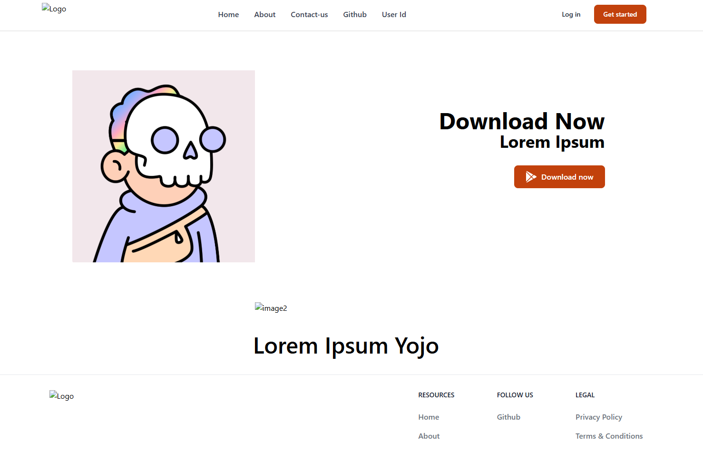
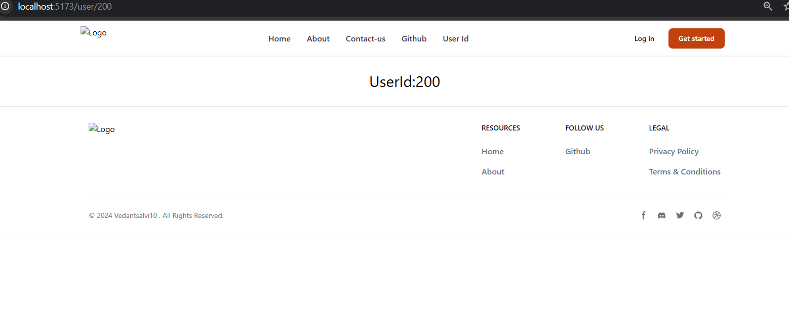

 
<h3>🎨 Theme Changer</h3>

This project implements a <strong>light mode and dark mode toggle</strong>, allowing users to switch themes dynamically. The theme state updates instantly based on user interaction.

<h4>🚀 Key Features:</h4>
<ul>
  <li>Implemented a <strong>toggle switch</strong> to switch between light and dark modes</li>
  <li>Managed theme state efficiently using <code>useState</code></li>
  <li>Persisted user preferences using <code>localStorage</code> (if implemented)</li>
  <li>Ensured smooth theme transitions for better user experience</li>
</ul>
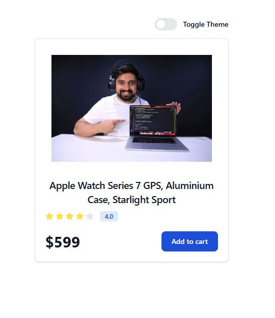
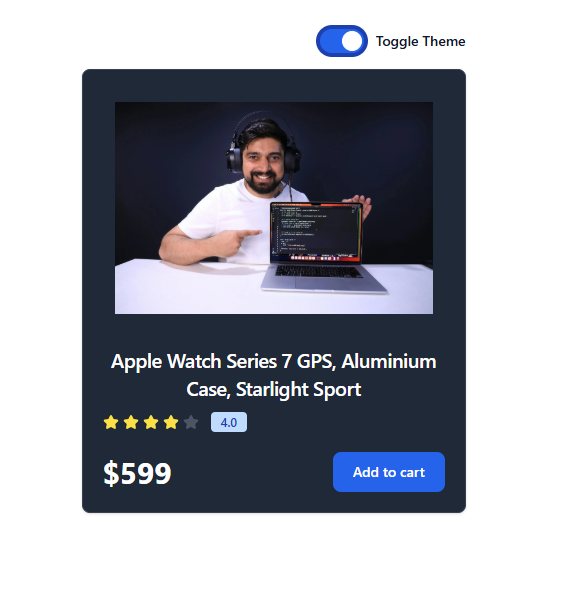

 
<h3>✅ To-Do App (Context API)</h3>

This project is a fully functional <strong>To-Do application</strong> built using React and <strong>Context API</strong> for state management. It allows users to add, update, and delete tasks seamlessly.

<h4>🚀 Key Features:</h4>
<ul>
  <li>Used <strong>Context API</strong> for efficient global state management</li>
  <li>Allows users to <strong>add, update, and delete</strong> to-do items</li>
  <li>Implemented a structured and responsive UI</li>
  <li>Ensured smooth user interactions with real-time state updates</li>
</ul>
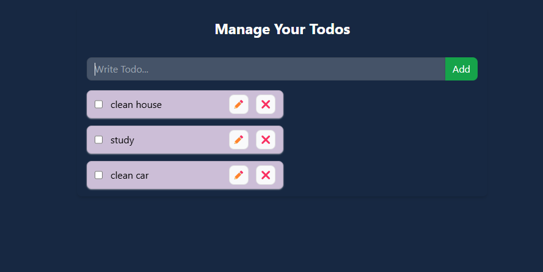
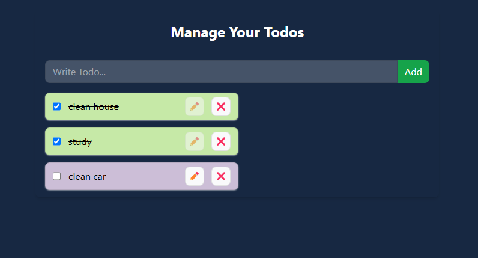
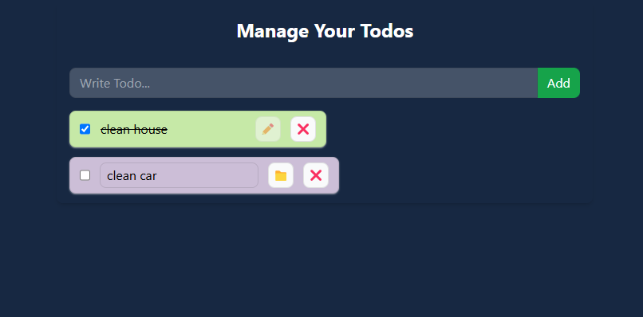

 
<h3>📝 To-Do App (Redux Toolkit)</h3>

This project is a fully functional <strong>To-Do application</strong> built using <strong>Redux Toolkit</strong> for state management. It tracks all activities in the Redux store, ensuring efficient state handling.

<h4>🚀 Key Features:</h4>
<ul>
  <li>Implemented <strong>Redux Toolkit</strong> for centralized state management</li>
  <li>Allows users to <strong>add and delete</strong> to-do items</li>
  <li>Tracks all actions and updates within the <strong>Redux store</strong></li>
  <li>Optimized performance with <code>createSlice</code> and <code>useSelector</code></li>
</ul>
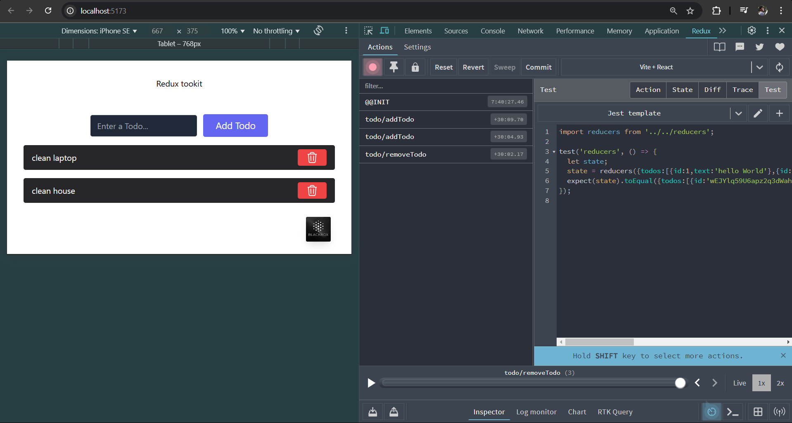
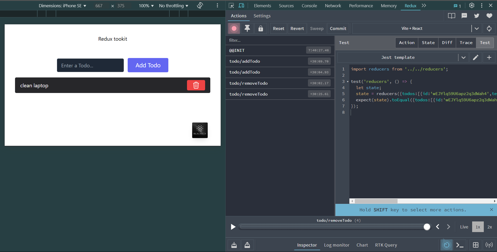

 
<h1 align="center">🚀 Blogify - A Full-Stack Blog Application</h1>

  <b>A modern blog platform built with React, Appwrite, and Tailwind CSS</b>  

---

<h2>📌 Description</h2>

  Blogify is a full-stack blog application that allows users to create, edit, delete, and view blog posts with rich-text formatting and image uploads. 
  The platform includes user authentication, role-based access control, and a clean UI for seamless content management.This is the final project of react series of mine.

---

<h2>🌟 Features</h2>
<ul>
  <li>✅ <b>User Authentication</b> (Signup, Login, Logout)</li>
  <li>✅ <b>Create, Edit, and Delete Blog Posts</b></li>
  <li>✅ <b>Rich Text Editor</b> (TinyMCE) for formatting content</li>
  <li>✅ <b>Image Uploads & Previews</b> via Appwrite Storage</li>
  <li>✅ <b>User-Based Access Control</b> (Only authors can edit/delete their posts)</li>
  <li>✅ <b>Post Status Management</b> (Active/Inactive)</li>
  <li>✅ <b>Responsive & Modern UI</b> using Tailwind CSS</li>
  <li>✅ <b>State Management</b> with Redux</li>
</ul>

---

<h2>🛠️ Tech Stack</h2>
<ul>
  <li><b>Frontend:</b> React, Redux, React Router, Tailwind CSS</li>
  <li><b>Backend & Database:</b> Appwrite (Authentication, Database, Storage)</li>
  <li><b>Rich Text Editor:</b> TinyMCE</li>
  <li><b>Deployment:</b> Vite</li>
</ul>
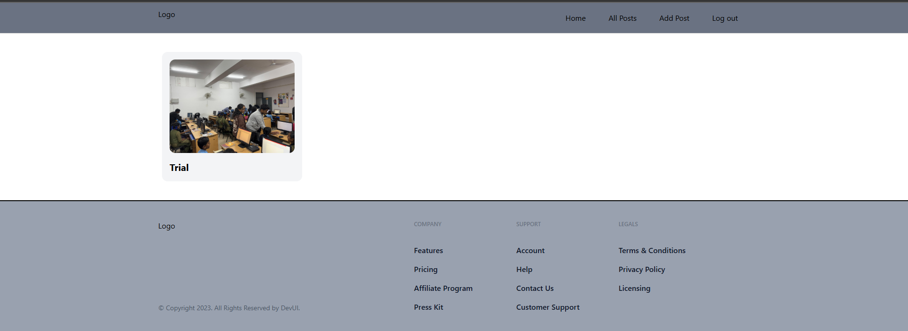
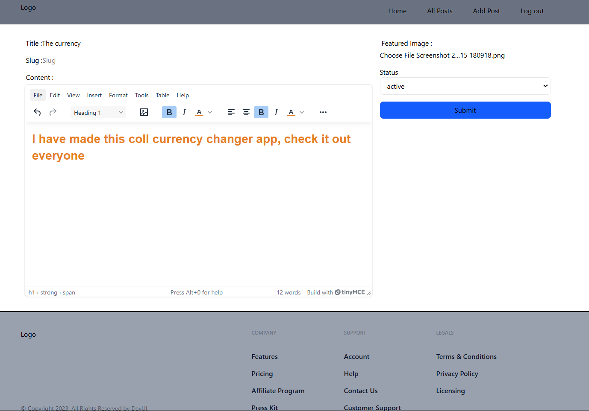
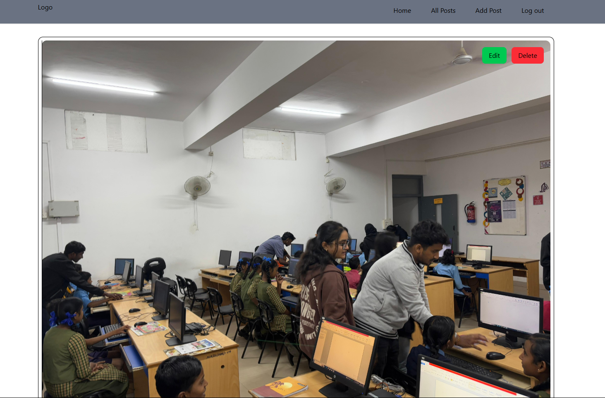
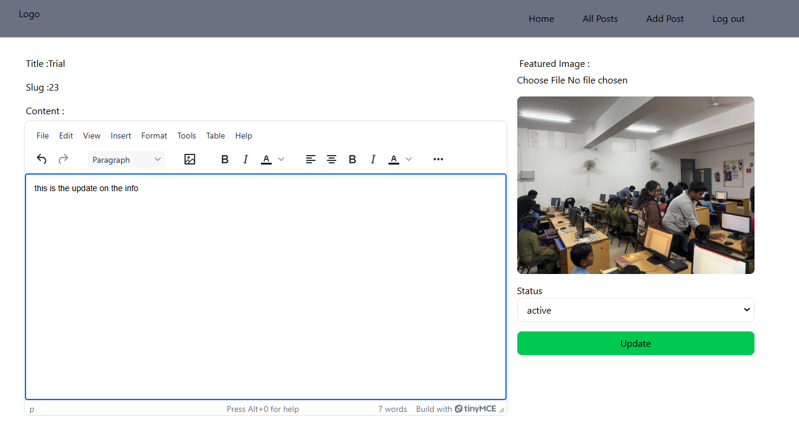
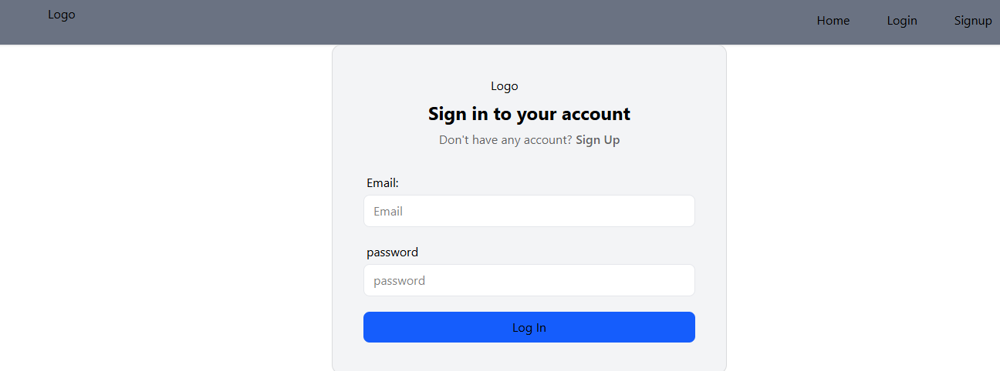
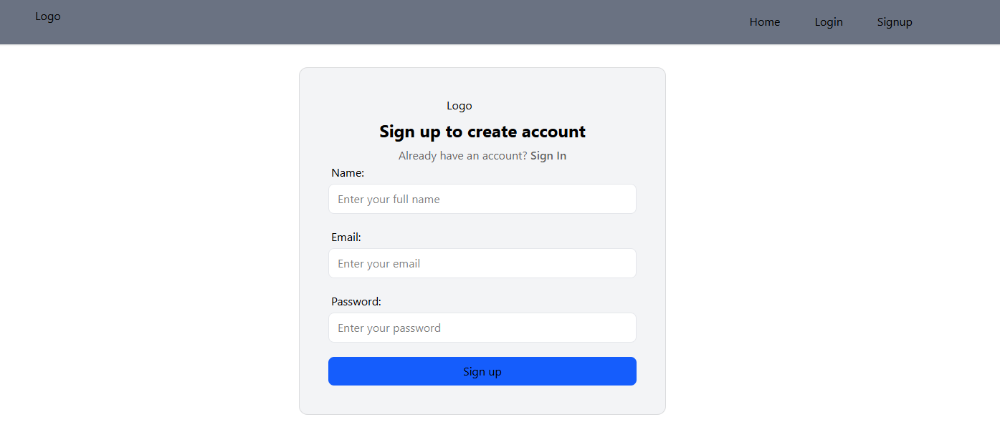