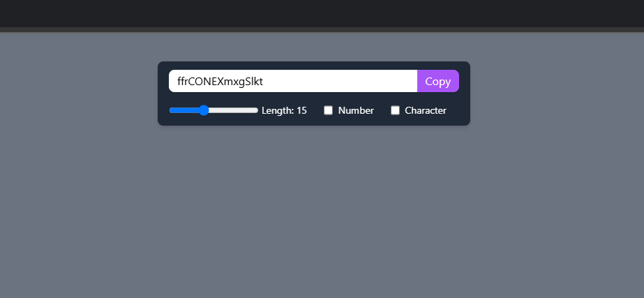
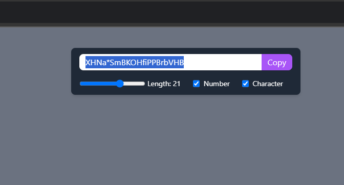
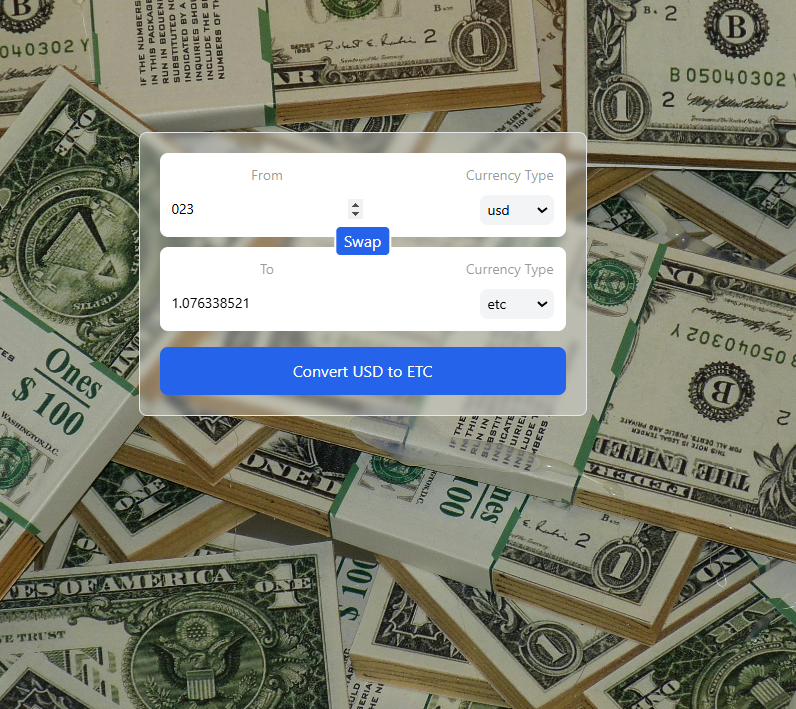

# React
<h2>Description</h2>

 This repository showcases my entire journey through the basics of react. I have learned everything I know in form of projects. There are 12 Projects in totat each focusing on different component of react.

 
<h3> 04 Background Changer</h3>

This is the project from where I started implementing hooks. The first hook that I implemented is useState. It's main purpose was to change the state of the color whenever a color is called.

 
<h3>🔑 Advanced Password Generator</h3>

This project extensively utilizes the <strong>useState</strong> hook to manage password generation dynamically. The state monitors various parameters, including length, numbers, and special characters, ensuring real-time updates.

<h4>🚀 Key Features:</h4>
<ul>
  <li>Efficient state management using <code>useState</code></li>
  <li>Optimized performance with <code>useCallback</code> and <code>useEffect</code></li>
  <li>Dynamic password updates based on selected criteria</li>
  <li>One-click copy button to copy the generated password to the clipboard</li>
</ul>

 
<h3>💱 Currency Converter</h3>

This project utilizes a <strong>Currency API</strong> to fetch real-time exchange rates and convert values between different currencies. It is built with reusable components and optimized with React hooks.

<h4>🚀 Key Features:</h4>
<ul>
  <li>Implemented modular and reusable <strong>React components</strong></li>
  <li>Fetched live exchange rates using a <strong>Currency API</strong></li>
  <li>Created <strong>custom hooks</strong> for better state management and reusability</li>
  <li>Used <code>useState</code> for dynamic state updates</li>
  <li>Optimized rendering with <code>useEffect</code> and <code>useCallback</code></li>
</ul>

 
