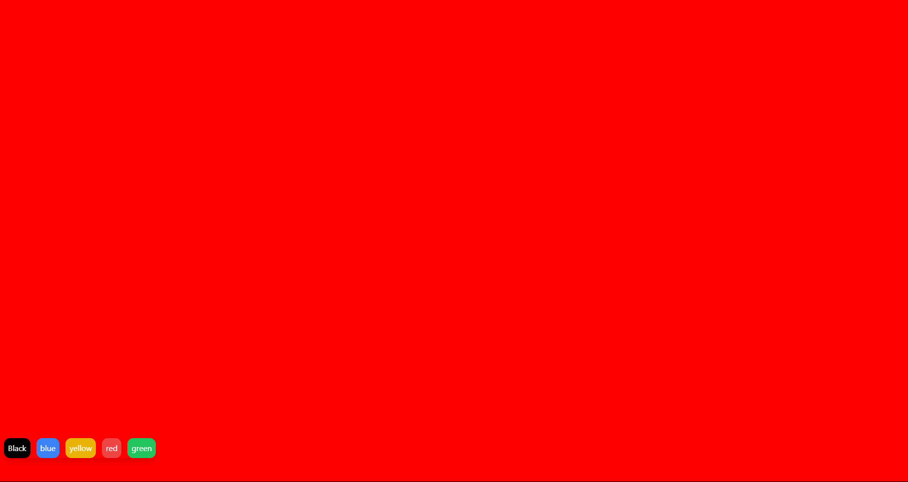

# React
<h2>Description</h2>

 This repository showcases my entire journey through the basics of react. I have learned everything I know in form of projects. There are 12 Projects in totat each focusing on different component of react.

 
<h3> 04 Background Changer</h3>

This is the project from where I started implementing hooks. The first hook that I implemented is useState. It's main purpose was to change the state of the color whenever a color is called.

